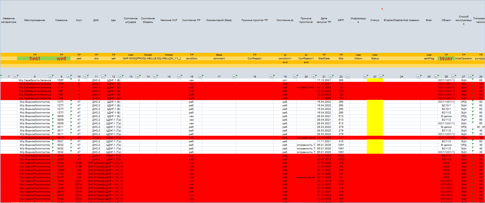

# Проект Automation_of_excel_work

## Оглавление  
[1. Описание проекта](README.md#Описание-проекта)  
[2. Какой кейс решаем?](README.md#Какой-кейс-решаем)  
[3. Краткая информация о данных](README.md#Краткая-информация-о-данных)  
[4. Этапы работы над проектом](README.md#Этапы-работы-над-проектом)  
[5. Результат](README.md#Результат)    
[6. Выводы](README.md#Выводы)
 [7. Работа программы](README.md#Работа-программы)

### Описание проекта
Автоматизация работы с файлами Excel с помощью языка Python. Файлы расположены в папке [data](data)

### Какой кейс решаем?    
Выполнения задач из ТЗ, а именно:
1)  Подсветить красным строку в файле "Отчет", если строка не найдена хотя бы в одном из 4х файлов
2)  Подсветить красным строку во всех файлах, если строка не найдена в файле "ОТЧЕТ"

### Краткая информация о входящих данных
В данном проекте участвовали 5 Excel файлов:
1) [Отчет](start_data/ОТЧЕТ%2001.2023.xlsx)
2) [Fond_ESP](start_data/Fond_ESP%2012.2022.xlsx)
3) [TRDS](start_data/TRDS%2012.2022.xlsx)
4) [Шахматка_11](start_data/ШАХМАТКА%2011.2022.xls)
5) [Шахматка_12](start_data/ШАХМАТКА%2012.2022.xls)

Более подробно можно ознакомится в [Т3](ТЗ.xlsx)

### Средство разработки и библиотеки
Для решения кейса использовал язык программирования Python и библиотеки:
* PyWin32
* Pandas

### Этапы работы над проектом 
1) Получение данных из файлов excel
2) Сравнение их между собой, согласно требованиями
3) Закрашивание строк, которые подходят по условиям
4) Сохранение изменений в файлах

### Результаты:
На выходе работы программы, получаем закрашенные Excel файлы

### Выводы:

Все посавленные задачи выполнены:
1) Задание номер 1: ✅
2) Задание номер 2: ✅
3) Автоматическое находит нужные столбцы/строки: ✅

Если информация по этому проекту покажется вам интересной или полезной, то я буду очень вам благодарен, если отметите репозиторий и профиль ⭐️⭐️⭐️-дами
